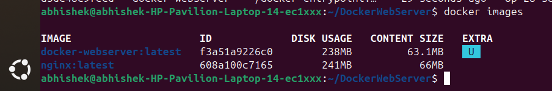
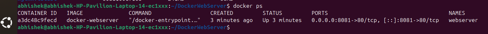
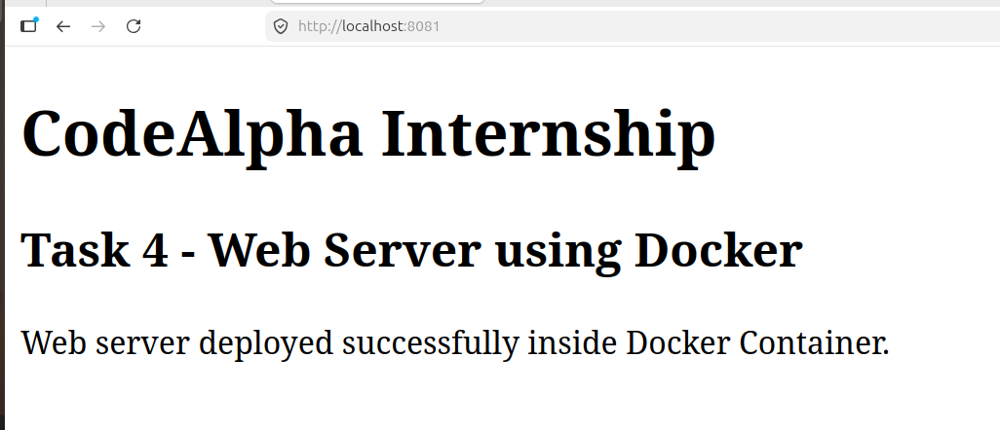
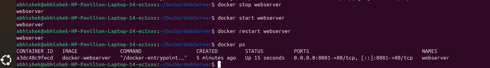
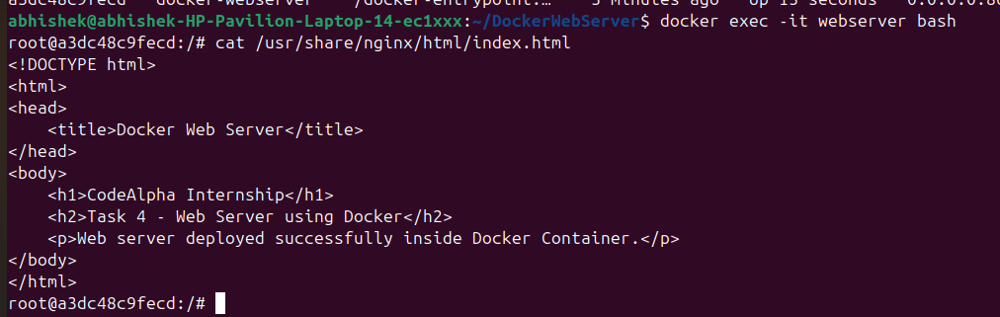
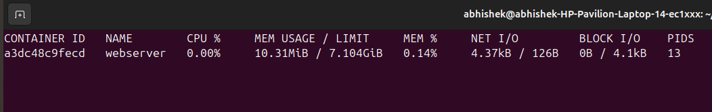
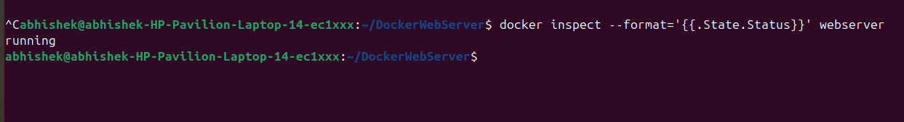

# 🚀 Docker Web Server Deployment

<div align="center">

# 🌐 Web Server using Docker

Deploying and Managing a Containerized Web Server using Docker


</div>

---

# 📌 Project Overview

This project demonstrates how to deploy a web server inside a Docker container using Nginx. The project covers container creation, image building, lifecycle management, monitoring, troubleshooting, and deployment best practices.

The web application is packaged into a Docker image and executed as a container, allowing consistent deployment across different environments.

---

# 🎯 Objectives

* Learn Docker containerization fundamentals
* Deploy a web server using Docker
* Build custom Docker images
* Understand Docker container lifecycle
* Monitor container health and resource utilization
* Troubleshoot container deployment issues
* Explore containerized application deployment

---

# 🛠️ Technologies Used

| Technology   | Purpose                   |
| ------------ | ------------------------- |
| Docker       | Containerization Platform |
| Nginx        | Web Server                |
| Ubuntu Linux | Host Operating System     |
| Git          | Version Control           |
| GitHub       | Source Code Management    |

---

# 📂 Project Structure

```text
DockerWebServer/
│
├── Dockerfile
├── index.html
├── README.md
│
└── screenshots/
    ├── 01-docker-image-build.png
    ├── 02-container-running.png
    ├── 03-webpage-output.png
    ├── 04-container-lifecycle.png
    ├── 05-container-inside-shell.png
    ├── 06-docker-stats.png
    └── 07-container-health.png
```

---

# 🏗️ Architecture Diagram

```text
┌─────────────────────┐
│     Web Browser     │
│  http://localhost   │
│       :8081         │
└──────────┬──────────┘
           │ HTTP Request
           ▼
┌─────────────────────┐
│   Docker Engine     │
│                     │
│ ┌─────────────────┐ │
│ │ Nginx Container │ │
│ │                 │ │
│ │  index.html     │ │
│ │     Port 80     │ │
│ └─────────────────┘ │
└─────────────────────┘
```

---

# 🔄 Workflow Diagram

```text
Developer
    │
    ▼
Create index.html
    │
    ▼
Create Dockerfile
    │
    ▼
Build Docker Image
    │
    ▼
Run Docker Container
    │
    ▼
Map Host Port 8081
    │
    ▼
Access Application
    │
    ▼
Monitor & Manage Container
```

---

# ⚙️ Dockerfile

```dockerfile
FROM nginx:latest

COPY index.html /usr/share/nginx/html/index.html

EXPOSE 80
```

---

# 🌐 Sample Web Page

```html
<!DOCTYPE html>
<html>
<head>
<title>Docker Web Server</title>
</head>
<body>
<h1>CodeAlpha Internship</h1>
<h2>Task 4 - Docker Web Server</h2>
<p>Web server successfully deployed inside Docker Container.</p>
</body>
</html>
```

---

# 🚀 Implementation Steps

## 1️⃣ Build Docker Image

```bash
docker build -t docker-webserver .
```

Verify:

```bash
docker images
```

---

## 2️⃣ Run Container

```bash
docker run -d -p 8081:80 --name webserver docker-webserver
```

Verify:

```bash
docker ps
```

---

## 3️⃣ Access Application

Open:

```text
http://localhost:8081
```

---

## 4️⃣ Container Lifecycle Management

Stop Container:

```bash
docker stop webserver
```

Start Container:

```bash
docker start webserver
```

Restart Container:

```bash
docker restart webserver
```

Remove Container:

```bash
docker rm webserver
```

---

## 5️⃣ Monitor Container

```bash
docker stats
```

---

## 6️⃣ View Logs

```bash
docker logs webserver
```

---

## 7️⃣ Access Container Shell

```bash
docker exec -it webserver bash
```

---

# 📊 Container Lifecycle

```text
Create
  │
  ▼
Running
  │
  ├── Stop
  ▼
Stopped
  │
  ├── Start
  ▼
Running
  │
  ├── Restart
  ▼
Running
  │
  ├── Remove
  ▼
Deleted
```

---

# 📷 Project Screenshots

## 1. Docker Image Build

[](screenshots/01-docker-image-build.png)

---

## 2. Running Container

[](screenshots/02-container-running.png)

---

## 3. Web Application Output

[](screenshots/03-webpage-output.png)

---

## 4. Container Lifecycle

[](screenshots/04-container-lifecycle.png)

---

## 5. Container Shell Access

[](screenshots/05-container-inside-shell.png)

---

## 6. Docker Statistics

[](screenshots/06-docker-stats.png)

---

## 7. Container Health Status

[](screenshots/07-container-health.png)

---

# 🔍 Troubleshooting Performed

### Issue

```text
Port 8080 already in use
```

### Cause

Jenkins server was running on port 8080.

### Solution

Docker container was deployed on port 8081.

```bash
docker run -d -p 8081:80 --name webserver docker-webserver
```

---

# 🌟 Learning Outcomes

* Docker installation and configuration
* Docker image creation
* Container deployment
* Port mapping concepts
* Container lifecycle management
* Docker monitoring and troubleshooting
* Containerized web server deployment
* Real-world DevOps workflow

---

# 💼 Real World Use Case

Organizations package applications into Docker images and deploy them consistently across development, testing, and production environments. Docker eliminates environment-related issues and enables scalable, portable, and reliable deployments.

---

# 📈 Future Enhancements

* Deploy multiple containers using Docker Compose
* Add custom Nginx configurations
* Implement container health checks
* Deploy on cloud platforms
* Integrate CI/CD pipelines using Jenkins
* Container orchestration with Kubernetes

---

# 👨‍💻 Author

**Abhishek K**

CodeAlpha Internship Project

Task 4 - Web Server using Docker

---

<div align="center">

### ⭐ If you found this project useful, give it a star ⭐

Docker • Nginx • Linux • DevOps • Containerization

</div>
